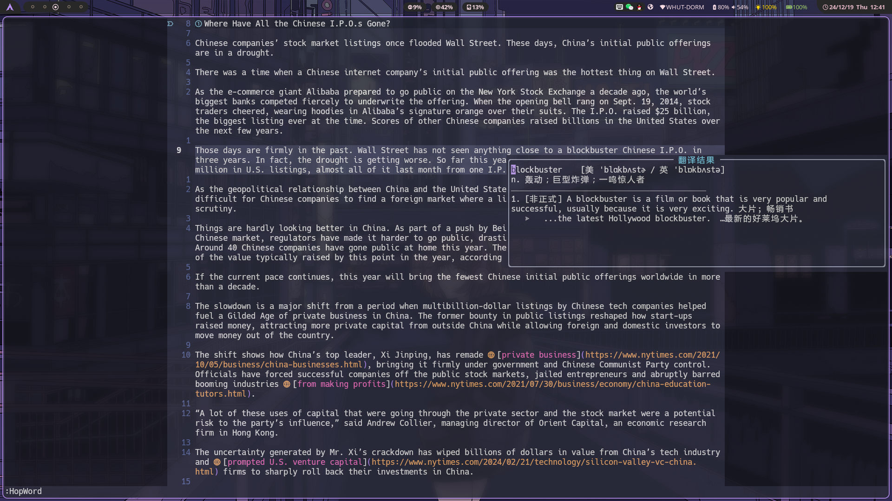

# 介绍

> 这是一个几乎完全由 Cursor 写的nvim翻译插件

 

使用的后端来自[kd](https://github.com/Karmenzind/kd)

需要先配置好[kd](https://github.com/Karmenzind/kd)


## 使用lazy配置：

```lua
return {
    "SilverofLight/kd_translate.nvim",
    config = function ()
        require("kd").setup({
            window = {
                -- your window config here
            }
        })
    end,
    vim.keymap.set("n", "<leader>t", ":TranslateNormal<CR>"),
    vim.keymap.set("v", "<leader>t", ":TranslateVisual<CR>")
}
```

## 默认的配置项：

```lua
-- 默认配置
M.config = {
    window = {
        width = 80,        -- 最大宽度
        height = 10,       -- 最大高度
        border = 'rounded', -- 边框样式
        title = ' 翻译结果 ', -- 标题
        title_pos = 'center', -- 标题位置
        style = 'minimal',    -- 窗口样式
        relative = 'cursor',  -- 窗口位置相对于光标
        focusable = true,    -- 是否可以获得焦点
        row = 1,             -- 相对于光标的垂直偏移
        col = 0,             -- 相对于光标的水平偏移
    }
    -- 添加了高亮组（目前只有这两个）
    highlights = {
        word = {
            fg = "#FF0000",    -- 前景色
            -- bg = "#FFFFFF",    -- 背景色
            bold = false,       -- 是否粗体
            italic = false,    -- 是否斜体
            underline = true  -- 是否下划线
        },
        phonetic = {          -- 音标高亮
            fg = "#00FF00",
            bg = "NONE",
            bold = false,
            italic = true,
            underline = false
        },
    },
    keymap = {
        scrollDown = "<C-f>",
        scrollUp = "<C-b>",
    },
}
```
